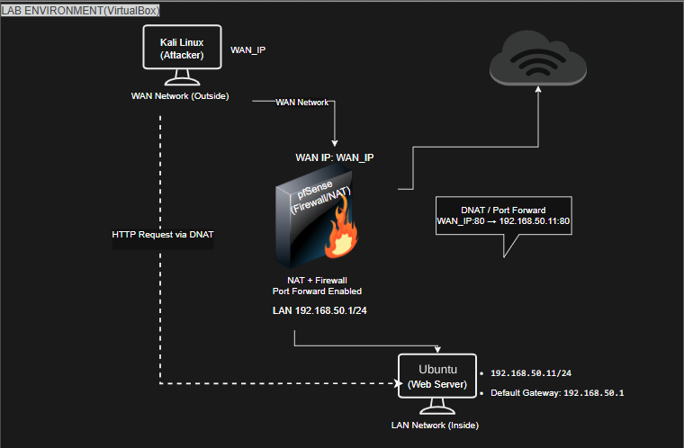

# pfSense Firewall & IPS Detection Lab

This repository documents a full firewall exposure and intrusion prevention simulation using pfSense and Suricata.


**Network Exposure, Intrusion Detection and Automated Blocking Simulation**

---

## 1. Introduction

This repository documents a controlled cybersecurity lab that demonstrates how a perimeter firewall and an Intrusion Prevention System (IPS) operate together in a segmented network environment. The lab was conducted entirely within an isolated VirtualBox infrastructure and simulates a realistic scenario in which a publicly exposed service becomes reachable through NAT and is subsequently targeted by an automated vulnerability scanner.

The experiment focuses on three defensive layers:

1. Default firewall behavior and stateful packet filtering
2. Service exposure via NAT port forwarding
3. Real-time detection and blocking using Suricata IPS

All phases are supported with verifiable evidence and packet-level observations.

---

## 2. Lab Architecture

The topology consists of three virtual machines connected through pfSense:

* **pfSense** – Firewall and IPS
* **Kali Linux** – External attacker
* **Ubuntu DVWA** – Vulnerable internal web server

The attacker resides on a simulated WAN network, while the DVWA server resides on an internal LAN network protected by pfSense.

### Topology Diagram



The diagram illustrates the logical separation between external and internal networks and shows how traffic must traverse the firewall to reach the web server.

---

## 3. Network Configuration

| Component   | Interface | Network              |
| ----------- | --------- | -------------------- |
| pfSense     | WAN       | Host-only network    |
| pfSense     | LAN       | Internal lab network |
| Kali        | Attacker  | WAN segment          |
| Ubuntu DVWA | Server    | LAN segment          |

pfSense performs:

* Stateful firewall filtering
* Network Address Translation (NAT)
* Intrusion detection and prevention via Suricata

---

## 4. Phase A — Default Firewall Behavior

### Objective

Verify that pfSense blocks unsolicited inbound connections by default.

### Host Verification

Kali attacker IP configuration:


pfSense installation and interface assignment:


DVWA server IP configuration:


Apache service running:


DVWA application reachable internally:


pfSense dashboard overview:


---

### Firewall Test

From the attacker network, a scan was performed against the pfSense WAN interface.

Result:


Port 80 returned a **filtered** state.

#### Interpretation

pfSense enforces a default deny inbound policy.
Without explicit rules or NAT forwarding, external hosts cannot initiate connections to internal services. This confirms that the firewall is functioning as expected and that no unintended exposure exists.

---

## 5. Phase B — NAT Port Forwarding

### Objective

Expose the internal DVWA web server to the WAN network.

A NAT port forwarding rule was created:


Configuration:

```
WAN TCP 80 → 192.168.1.102:80
```

This rule forwards external HTTP requests to the internal DVWA host.

---

### External Reachability Test

The attacker scanned the firewall again after the NAT rule was applied.


Port 80 was now reported as **open**.

#### Interpretation

NAT does not provide security.
It simply forwards traffic. Once the rule was added, the internal web server became reachable from the external network. This demonstrates how misconfigured or unnecessary port forwarding can expose services to attackers.

---

## 6. Phase C — Suricata IPS Deployment

### Objective

Deploy an intrusion prevention system capable of detecting and blocking malicious traffic.

Suricata was installed through the pfSense package manager.


The WAN interface was configured for inspection and blocking.


Configuration highlights:

* IPS mode enabled
* Block offenders enabled
* ET Open rule set enabled
* Source IP blocking selected

---

### IPS Operation Model

Suricata inspects packets passing through the firewall.
When a signature match occurs:

1. An alert is generated
2. The source IP is flagged
3. Firewall states are terminated
4. The IP is added to the block list

This transforms passive detection into active prevention.

---

## 7. Phase D — Attack Simulation

### Objective

Simulate automated vulnerability scanning from the attacker network.

Nuclei was used to generate realistic scanning traffic.


The scanner attempted HTTP probing and signature-triggering requests against the exposed DVWA service.

---

## 8. Detection Evidence

Suricata detected anomalous traffic patterns generated by the scanner.


Example alert:

```
SURICATA HTTP Host header invalid
```

This confirms that inspection rules were triggered by the attack traffic.

---

## 9. Automatic Blocking

The attacker IP was automatically blocked.


The block list shows the external attacker IP and the corresponding signature responsible for the block.

Subsequent connectivity tests confirmed that:

* HTTP requests failed
* Port scans returned filtered
* The attacker was fully isolated

---

## 10. Technical Analysis

### Firewall Layer

Implements a default deny policy and stateful inspection.

### NAT Layer

Introduces exposure when forwarding is configured.

### IPS Layer

Provides deep packet inspection and automated response.

The lab demonstrates a complete defensive chain:

```
Firewall → Exposure → Detection → Blocking
```

---

## 11. Key Findings

1. Default firewall policies effectively prevent unsolicited access.
2. NAT rules introduce risk by exposing internal services.
3. IPS detection significantly reduces attacker dwell time.
4. Automated blocking prevents continued scanning and exploitation.
5. Layered defense remains critical in network security architecture.

---

## 12. Conclusion

This lab successfully demonstrated how a service can transition from being fully protected to publicly exposed and then protected again through intrusion prevention.

The experiment validates the effectiveness of combining:

* Stateful firewall filtering
* Controlled NAT exposure
* Signature-based intrusion prevention

The environment closely resembles real enterprise perimeter security architectures and provides a reproducible defensive testing scenario.

---

## 13. Evidence Directory

All screenshots referenced in this document are stored under:

```
/evidence
```

They correspond directly to each phase described above and provide verifiable proof of configuration, detection, and blocking events.

---

## 14. Author

Security Lab Simulation
Firewall and IPS Defensive Testing Environment
VirtualBox Isolated Network

